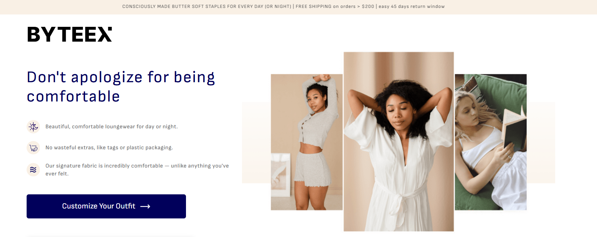

# 🚀 Byteex App

**Byteex App** is a company product page developed according to the design in [Figma](https://www.figma.com/design/S2YR3ijlPpGp9KWx4jl0qz/Byteex---Standard-Development-Test?node-id=0-1&p=f&t=BhH2Oak6P9KQES51-0).

[**Live page**](https://byteex-app-pi.vercel.app/)

## 🖼️ Preview



## 📌 Key Features

- Responsive design for mobile, tablet (up to 1463px), and desktop devices (from 1464px).
- Dynamic content is fetched from:
  - [Pixabay](https://pixabay.com) – images
  - [JSONPlaceholder](https://jsonplaceholder.typicode.com/) – test reviews
- Built with **HTML, CSS, JavaScript**, and **React**.

## 🛠 Technologies & Libraries

| Technology / Library                                                                   | Description                                        |
| -------------------------------------------------------------------------------------- | -------------------------------------------------- |
| [Axios](https://www.npmjs.com/package/axios)                                           | For asynchronous requests                          |
| [modern-normalize](https://www.npmjs.com/package/modern-normalize)                     | Styles normalization & cross-browser compatibility |
| [Swiper](https://swiperjs.com/)                                                        | Sliders on the page                                |
| [react-accessible-accordion](https://www.npmjs.com/package/react-accessible-accordion) | Accordion for the FAQ section                      |
| [react-spinners](https://www.npmjs.com/package/react-spinners)                         | Loaders for dynamic content                        |
| [Vite](https://vitejs.dev/)                                                            | Project bundler                                    |
| [Vercel](https://vercel.com/)                                                          | Deployment platform                                |

## 📥 Running the Project Locally

```sh
git clone https://github.com/your-repo/byteex-app.git
cd byteex-app
npm install
npm run dev
```

## 🖋️ Author

Mariia Ostapets, Fullstack developer
[LinkedIn](https://www.linkedin.com/in/mariia-ostapets/) |
[GitHub](https://github.com/Mariia-Ostapets)
